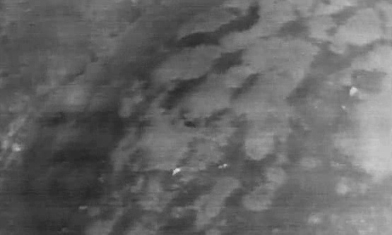
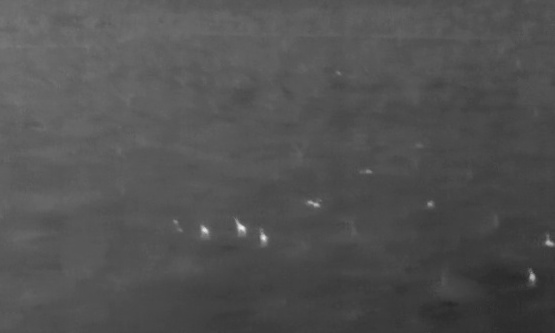

**tir-vision**: This research aimed to identify effective vision approaches for thermal infrared cameras mounted on unmanned aerial vehicles (UAVs), specifically for use in conservation. This is often a challenging data setting, as objects of interest (humans, elephants, lions, etc.) may be small, occluded, or sparse. 

This repository contains sample code implementing a training methodology to identify and improve small object detection/classification benchmarks, particularly in real-time settings. I used the TensorFlow Object Detection [Model Zoo](https://github.com/tensorflow/models/blob/master/research/object_detection/g3doc/tf2_detection_zoo.md), and tested several augmentation approaches, classification models (Inception, ResNet, MobileNet, etc.), and detection models (CenterNet, SSD, Faster R-CNN, etc.). I saw good results for various accuracy and efficiency tradeoffs, and future research will focus on further improving the vision pipelines using an active learning approach. 

> *included concepts:  object detection, object classification, TensorFlow, Keras*

Sample TIR Imagery - <a href="http://lila.science/datasets/conservationdrones">BIRDSAI</a>

  

